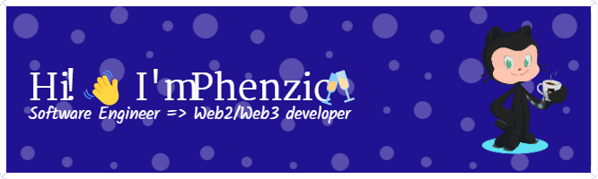

 

          

<!--  -->

Here are some ideas to get you started:
- 🔭 I’m currently working on Awesome
- 🌱 I’m learning and growing in the Web3 
- 👯 I’m looking to collaborate with Innovative minds
- 💬 Ask me about Anything, I'm not perfect but i can help 
- 😄 Pronouns: Dude/Bruv
- ⚡ Fun fact: I'm Impulsive 

<h3 align="left">Connect with me:</h3>

<a href="https://wa.me/2349059254549?text=Hi>>> Phenzic" target="_blank">
  
</a>&nbsp;&nbsp;
&nbsp;&nbsp;
&nbsp;&nbsp;
&nbsp;&nbsp;
<!--    -->

  

